# FixIt App

🚧 Work In Progress 🚧

 FixIt App is an android application for my school final year project consuming [FixIt API]("https://github.com/VictorKabata/FixIt-API) that allows users to find repair services for their faulty/broken equipment or help repair technicians find customers who need repiar services near them. 
 It has been built using MVVM Architecture as well as Jetpack Components.

 Min API Level: 21 [Supports Over 87% Devices ](https://developer.android.com/about/dashboards)

 Build System: [Gradle](https://gradle.org/)

 ## Table of Contents

- [Prerequisite](#prerequisite)
- [Libraries](#libraries)
- [Related Posts](#related-posts)
- [Screenshots](#screenshots)

## Prerequisite.
- In order to run the application, you need to [clone]("link_to_clone)/[fork]("link_to_fork) the [FixIt API]("https://github.com/VictorKabata/FixIt-API).

- Download the [Go Programming Language SDK]("https://golang.org/dl/) in your computer.

- Navigate to the cloned repository directory in your computer from the command terminal and run the golang command in order to start the server.

```Go
go run .
```

- Ensure that your android device/emulator and your computer or on the same wireless network.
- Check the ip address of the wireless network from the command terminal using `ipconfig` command.
- In the FixIt App `app` module under `utils` package and `Constants object` modify the `BASE_URL` constant and add your ip address. e.g 
```Kotlin
const val BASE_URL: String = "http://your_ip_address:8081/
```
- Build and run the application.

## Libraries.
- [Hilt](https://github.com/google/hilt) - Dependency Injection library.
- [Jetpack](https://developer.android.com/jetpack)
  - [Viewmodel](https://developer.android.com/topic/libraries/architecture/viewmodel) - Manage UI related data in a lifecycle conscious way .
  - [Data Binding](https://developer.android.com/topic/libraries/data-binding) - Support library that allows binding of UI components in  layouts to data sources.
- [Room]() - Provides an abstraction layer over SQLite used for offline data caching.
- [Navigation Component]()-Component that allows easier implementation of navigation from simple button clicks to more complex patterns.
- [Retrofit](https://square.github.io/retrofit/) - Type-safe http client 
and supports coroutines out of the box.  
- [GSON](https://github.com/square/gson) - JSON Parser,used to parse 
requests on the data layer for Entities and understands Kotlin non-nullable 
and default parameters.
- [OkHttp-Logging-Interceptor](https://github.com/square/okhttp/blob/master/okhttp-logging-interceptor/README.md) - Logs HTTP request and response data.
- [kotlinx.coroutines](https://github.com/Kotlin/kotlinx.coroutines) - Library Support for coroutines.
- [Timber]()-Library for easier logging.
- [Material Design](https://material.io/develop/android/docs/getting-started/) - Build awesome beautiful UIs.
- [Glide]()- Image Library from loading images from the database and cacheing in memory.

## Related Posts.

## Screenshots.

### Login and Registration.
The user will be provides with a login page where they can login if the had previously registered else they can navigate to registration page.

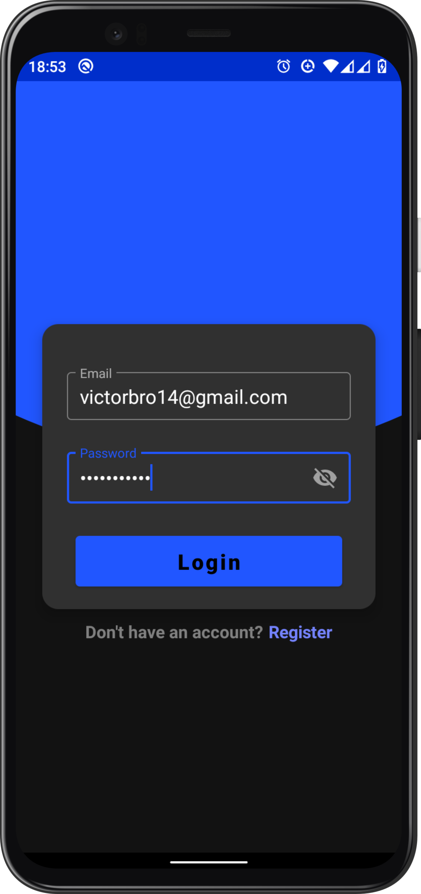 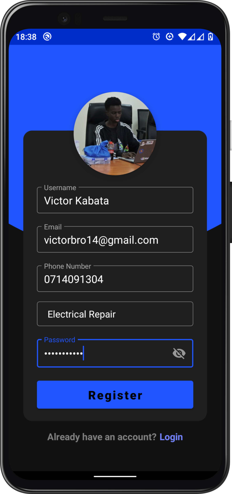 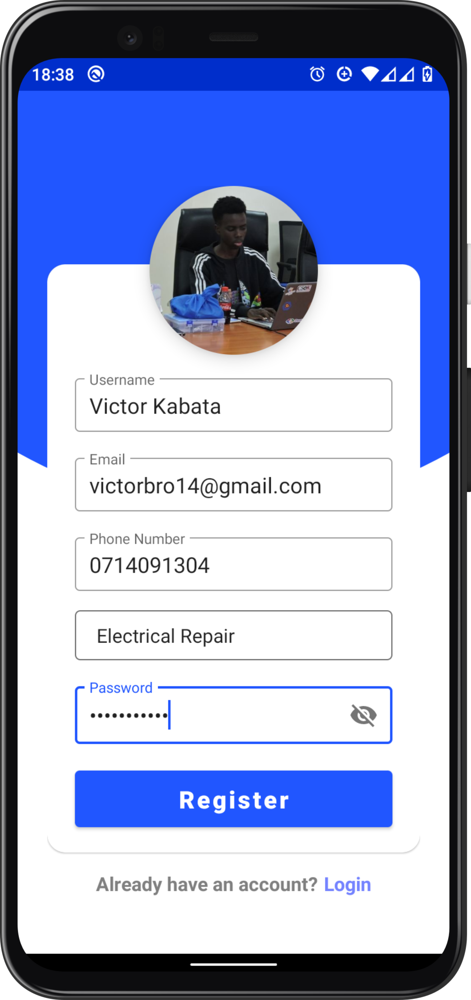 


### Home.
The user is presented with a home page where they can see upload made by other users and navigate to various other pages from the navigation drawer, clicking the floating action button to navigate to Upload page or clicking on a post to see post details

 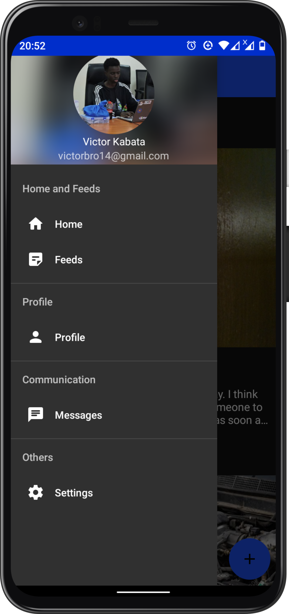


### Upload.
The user is presented with upload page where they can take a photo of their problem, choose a category, write a brief yet detailed description of their problem and write down their budget for their repair. The app can automaticaly detect your location.

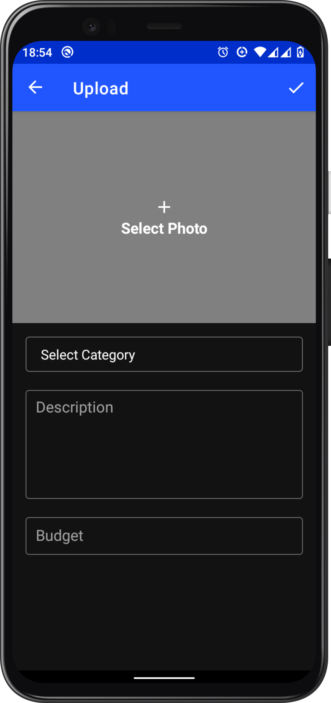 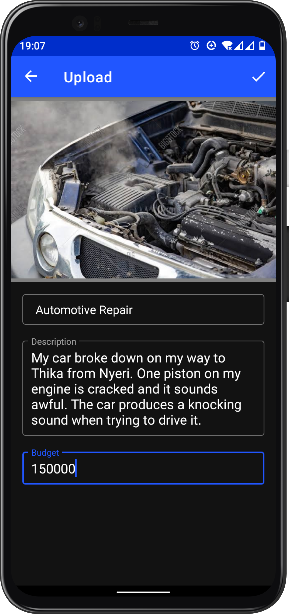 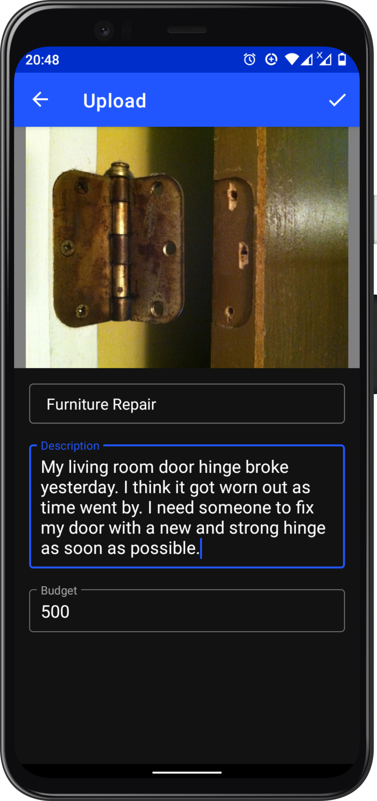 


### Post Details.
The user is presented with more details about a post, where they can book the work, contact the uploader and see the uploaders' profile.

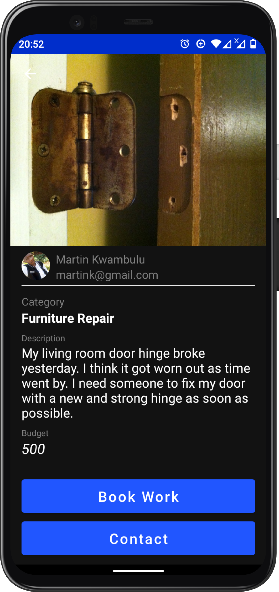 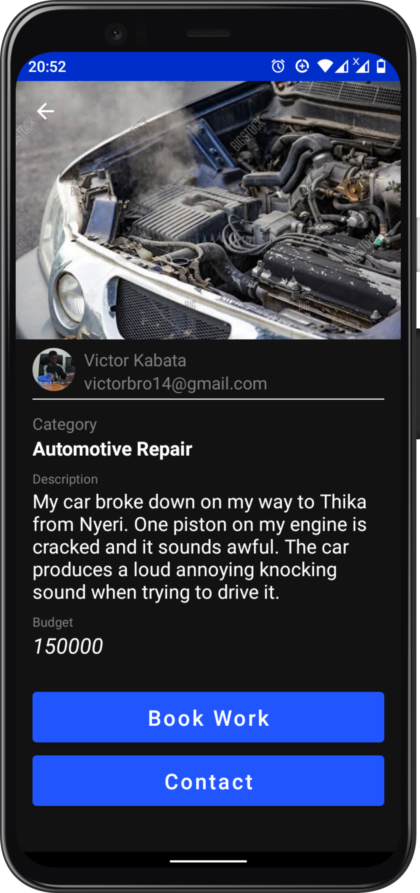 


### User Profile.
The user is presented with contact information, rating and location of the user.

 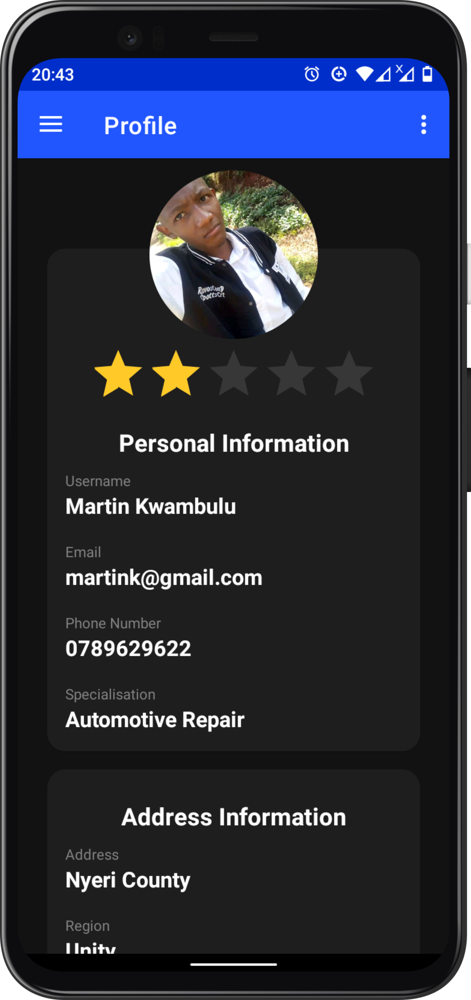 


### Post Bookings.
The user is presented with a list of other user/repair technicians who have applied for the work of their posts.

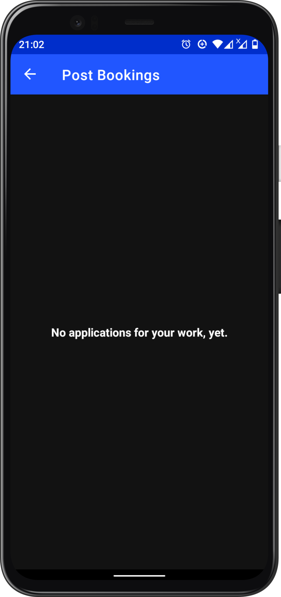 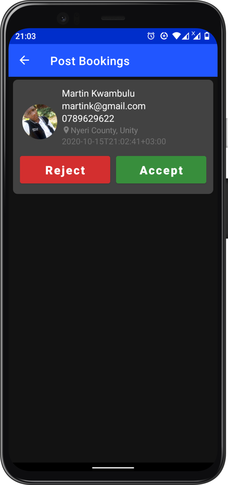 

